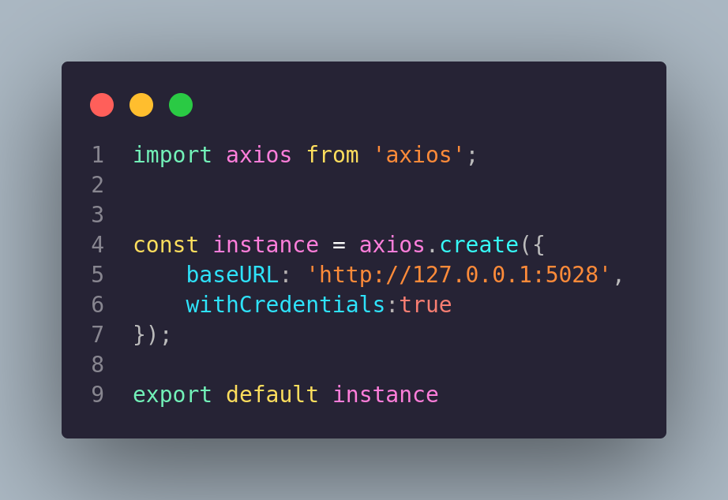

# loginReact

### Configuración previa

- ##### configuración del servidor:

Para inicar con la ejecución del proyecto se debe cambiar el nombre del archivo ubicado en la raíz del proyecto llamado `.env.example` a `.env`  o crear un archivo `.env` **debe llenarlo con sus necesidades**.

```json
MY_SERVER={"hostname":"127.0.0.1", "port":4017}
ATLAS_PASSWORD="campus123"
ATLAS_DB="loginReact"
JWT_PASSWORD="K_{SDOj24_"
VITE_HOST="127.0.0.1"
VITE_PORT_FRONTEND=5026
VITE_PORT_BACKEND=5028
```

- ##### Configuración de axios

seguido de esto modificar el archivo encontrado en la siguiente ruta `api/axios.js`. Se cambia el valor de **baseURL** seguido de la ruta en donde esta el servidor. 



- ##### Descargar dependencias

  Para poder ejecutar el proyecto correctamente es necesario importar las librerias utilizadas, para esto se debe ejecutar el siguiente comando:

  ```bash
  npm i
  ```


### Ejecución 

Para probar el login debe ejecutar los siguientes comandos:

- **Ejecutar el servidor:** Para poder recibir peticiones y establecer un correcto funcionamiento:

  ```bash
  npm run start
  ```

  **Expected Output**

  ```bash
  
  > loginreact@0.0.0 start
  > nodemon app/server.js
  
  [nodemon] 3.0.1
  [nodemon] to restart at any time, enter `rs`
  [nodemon] watching path(s): *.*
  [nodemon] watching extensions: js,mjs,cjs,json
  [nodemon] starting `node app/server.js`
  Server listening on http://127.0.0.1:5028
  ```

  

  

- **Ejecutar vite:** Para poder interactuar con la interfaz, se debe correr el siguiente comando:

  ```bash
  npm run dev
  ```

​		**Expected Output**

    ```bash 
      VITE v4.4.9  ready in 161 ms

      ➜  Local:   http://127.0.0.1:5026/
      ➜  press h to show help
    ```


